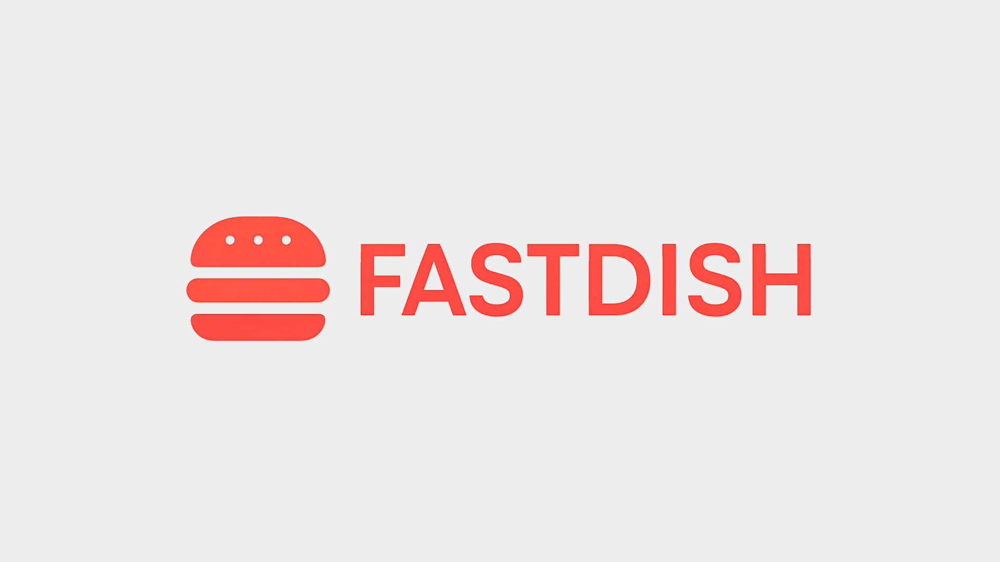

# 🍔 FastDish

<p align="center">
  
</p>

**FastDish** é um sistema web desenvolvido em **React + Vite** que simula o fluxo de pedidos de uma lanchonete. Do cardápio até a finalização do pedido. O projeto transforma um site estático em uma aplicação dinâmica, com componentes reutilizáveis, hooks personalizados e integração com APIs úteis para um fluxo realista de pedidos.

---

## 🔗 Deploy (demo)

Acesse a versão hospedada:

👉 https://fastdish.vercel.app/

---

## 🎯 Objetivo

Oferecer uma base front-end prática e organizada para um sistema de pedidos online, com ênfase em:

- Experiência de usuário (UX) simples e responsiva
- Componentização e reuso via React
- Estado do carrinho gerenciado por hooks
- Facilitar integração com backend e serviços externos

---

## 🚀 Funcionalidades

- 🍽️ **Menu por categorias** — navegue por lanches, pizzas, bebidas etc.
- 🛒 **Carrinho dinâmico** — adicionar/remover itens e atualização em tempo real
- 💰 **Cálculo automático do total** — subtotal, taxas (se configuradas) e total
- 🏠 **Busca de endereço por CEP (ViaCEP)** — preenchimento automático do endereço
- 💬 **Envio do pedido via WhatsApp** — gera uma mensagem pronta para o estabelecimento
- 💳 **Formas de pagamento** — Dinheiro, Cartão (Crédito/Débito) e PIX (QR Code e copia/cola)
- ⚙️ **Hook `useCart`** — encapsula toda lógica do carrinho
- 📱 **Layout responsivo** — pensado para desktop e mobile

---

## 🖼️ Demonstrações do Projeto

> Substitua as imagens em `public/screens/` por capturas reais se desejar.

<p align="center">
  
</p>

<p align="center">
  
</p>

---

## 🛠️ Tecnologias Utilizadas

- React 18
- Vite
- JavaScript (ESNext)
- CSS

### Integrações

- ViaCEP — busca de endereço por CEP
- WhatsApp — envio do pedido
- qrcode (npm) — geração de QR Code para PIX

---

## 📁 Estrutura do Projeto (resumo)

src/
├── App.jsx
├── main.jsx
├── assets/ (imagens)
├── components/ (Header, Menu, DishCard, Modals...)
├── hooks/ (useCart, ...)
├── services/ (ViaCEP, WhatsApp, gerador de PIX)
└── styles/ (CSS)

public/ (estáticos: imagens, favicon)
package.json
vite.config.js

---

## 💻 Como Executar (local)

Siga estes passos para rodar o projeto localmente:

1. Clone o repositório

```bash
git clone https://github.com/eikefrota/fastdish.git
```

2. Acesse a pasta do projeto

```bash
cd fastdish
```

3. Instale as dependências

```bash
npm install
```

4. Rode em modo desenvolvimento

```bash
npm run dev
```

5. Build para produção

```bash
npm run build
```

6. Preview da build

```bash
npm run preview
```

O Vite por padrão abre em http://localhost:5173.

### Scripts (exemplo em package.json)

```json
{
  "scripts": {
    "dev": "vite",
    "build": "vite build",
    "preview": "vite preview",
    "test": "vitest"
  }
}
```

---

## ✅ Testes

Recomenda-se executar:

```bash
npm run test
```

Execute os testes antes de abrir PRs para garantir o funcionamento dos hooks e utilitários (ex.: `useCart`, gerador de PIX e envio via WhatsApp).

---

## 🤝 Como Contribuir

1. Faça um fork do repositório
2. Crie uma branch:

```bash
git checkout -b feature/minha-melhora
```

3. Faça commits das alterações
4. Abra um Pull Request para `main`

---

## 👨‍💻 Autor

Eike Frota

---

Se quiser, posso gerar uma versão do README com badges automáticas e links diretos para o LinkedIn/GitHub. Deseja que eu adicione?
